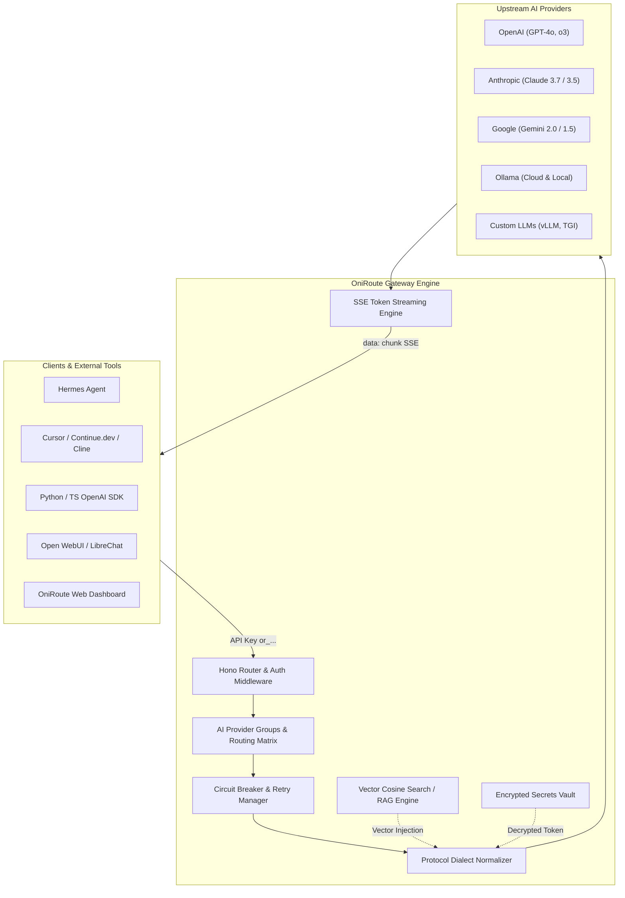

<p align="center">
  
</p>

<h1 align="center">OniRoute</h1>

<p align="center">
  <strong>Self-Hostable AI Gateway & Knowledge Router — Multi-Provider Failover, Provider Groups, Token Streaming, Encrypted Vault, Private Vector RAG, and OpenAI-Compatible API.</strong>
</p>

<p align="center">
  <a href="LICENSE"></a>
  <a href="CODE_OF_CONDUCT.md"></a>
  <a href="CONTRIBUTING.md"></a>
  <a href="SECURITY.md"></a>
  <a href="https://leadspree.in"></a>
</p>

<p align="center">
  
  
  
  
  
  
  
</p>

<p align="center">
  <a href="https://github.com/AniruddhaDas1/OniRoute/stargazers"></a>
  <a href="https://github.com/AniruddhaDas1/OniRoute/forks"></a>
  <a href="https://github.com/AniruddhaDas1/OniRoute/issues"></a>
  <a href="https://github.com/AniruddhaDas1/OniRoute/commits/main"></a>
</p>

---

## 📖 Table of Contents
- [Overview](#-overview)
- [Architecture & Request Flow](#-architecture--request-flow)
- [Quick Start](#-quick-start)
  - [Mode 1: Permanent Standalone Local Server (Port 1001)](#mode-1-permanent-standalone-local-server-port-1001--zero-docker-zero-cloud)
  - [Mode 2: Local Supabase Stack (Docker)](#mode-2-local-supabase-stack-docker--100-free)
  - [Mode 3: Supabase Cloud](#mode-3-supabase-cloud)
- [Universal Client Support & Integrations](#-universal-client-support--integrations)
  - [1. Hermes Agent & Desktop AI Clients](#1-hermes-agent--desktop-ai-clients)
  - [2. IDEs & AI Coding Assistants (Cursor, Continue, Cline)](#2-ides--ai-coding-assistants-cursor-continuedev-cline)
  - [3. Python (OpenAI SDK)](#3-python-openai-sdk)
  - [4. TypeScript / Node.js](#4-typescript--nodejs)
  - [5. cURL](#5-curl)
- [Core Features](#-core-features)
  - [AI Provider Groups & Routing Profiles](#1-ai-provider-groups--routing-profiles)
  - [4-Dimensional Gateway API Key Configuration](#2-4-dimensional-gateway-api-key-configuration)
  - [Real-time Token Streaming (SSE)](#3-real-time-token-streaming-sse)
  - [Smart Failover & Circuit Breaker](#4-smart-failover--circuit-breaker)
  - [Encrypted Key Vault](#5-encrypted-key-vault)
  - [Private Vector RAG Engine](#6-private-vector-rag-engine)
  - [Audit Logs & Token Accounting](#7-audit-logs--token-accounting)
- [Curated Coding Knowledge Base](#-curated-coding-knowledge-base)
- [Hosting on a Custom Domain](#-hosting-on-a-custom-domain)
- [API Reference](#-api-reference)
- [Verification & Testing](#-verification--testing)
- [License](#-license)

---

## 🌟 Overview

**OniRoute** is an open-source, self-hostable AI gateway designed to unify and safeguard your LLM infrastructure. Add multiple provider credentials once (OpenAI, Anthropic Claude, Google Gemini, Ollama, and Custom OpenAI-compatible endpoints), and expose a single, high-reliability endpoint.

### Why OniRoute?
- **Unified Interface**: Use one OpenAI-compatible endpoint (`/v1/chat/completions`) across all models and providers.
- **Provider Groups**: Cluster models into specialized groups (e.g. *Coding LLMs*, *Reasoning & DeepSeek*, *Ollama Cluster*) and configure failover rules per group.
- **Real-time SSE Streaming**: Full support for Server-Sent Events (`stream: true`) with token-by-token streaming for Hermes Agent, Cursor, and ChatGPT clients.
- **Resilient Failover**: If an upstream provider returns `429 Too Many Requests`, `5xx Server Error`, or times out, OniRoute seamlessly retries with your backup providers without dropping client requests.
- **Zero Key Exposure**: Client apps, friends, and CI pipelines receive revocable `or_...` gateway keys. Upstream provider secrets remain securely encrypted in Supabase Vault or local AES-256-GCM storage.
- **Private Semantic RAG**: Ingest documentation from public GitHub repositories or text snippets. Automatically query 1536-dimensional embeddings to enrich completions with relevant context.
- **Flexible Deployment**: Run locally as a single Node process on **Port 1001** (zero external dependencies), in a local Docker Supabase stack, or deployed to Supabase Cloud.

---

## 🏗 Architecture & Request Flow



---

## ⚡ Quick Start

### Mode 1: Permanent Standalone Local Server (Port 1001 — Zero Docker, Zero Cloud)

Run OniRoute locally with an embedded local store:

```sh
# 1. Install dependencies
npm install

# 2. Run the local gateway test suite
npm run test:local

# 3. Start the local background gateway on Port 1001
npm run start:server
```

Open the dashboard in standalone mode:
```sh
VITE_API_URL=http://localhost:1001 npm run dev
```

---

### Mode 2: Local Supabase Stack (Docker — 100% Free)

Run the full Supabase Docker stack (PostgreSQL, `pgvector`, Supabase Vault, Auth, and Edge Functions):

```sh
# Start local Supabase containers and apply migrations
npm run setup:local

# Start the Vite dashboard
npm run dev
```

* **Web Dashboard**: `http://localhost:5173`
* **Supabase Studio**: `http://127.0.0.1:54323`
* **Gateway Endpoint**: `http://127.0.0.1:54321/functions/v1/api/v1/chat/completions`

---

### Mode 3: Supabase Cloud

1. Create a project at [supabase.com](https://supabase.com) and copy `.env.example` to `.env`.
2. Add your project URL and **publishable** key to `.env`.
3. Push migrations and deploy Edge Functions:
   ```sh
   supabase db push
   supabase functions deploy api --no-verify-jwt
   npm run dev
   ```

---

## 👥 Universal Client Support & Integrations

Because OniRoute implements the standard **OpenAI Chat Completions API specification**, any external LLM tool, IDE, or script can connect directly to your OniRoute endpoint.

### 1. Hermes Agent & Desktop AI Clients

In **Hermes Agent** (or any desktop AI interface):

| Field | Recommended Value | Notes |
| :--- | :--- | :--- |
| **Name** | `OniRoute Gateway` | Display name |
| **Provider ID** | `oniroute` | Unique identifier (lowercase) |
| **Endpoint URL** | `https://skbbzlwzsarmideehvmz.supabase.co/functions/v1/api/v1`<br>*or Local:* `http://127.0.0.1:1001/v1` | **Cloud Edge Gateway** or **Local Gateway** |
| **Default Model** | `oniroute` *(or any active model name)* | Automatically routed based on assigned group |
| **Context** | `Auto` | OniRoute manages per-key token limits |
| **API Key** | `or_...` | Your generated key from the dashboard |
| **Discover models** | ☑️ Checked | Discovers models via `/v1/models` |

---

### 2. IDEs & AI Coding Assistants (Cursor, Continue.dev, Cline)

Configure your tool's OpenAI settings:
- **Base URL**: `https://skbbzlwzsarmideehvmz.supabase.co/functions/v1/api/v1` *(or `http://localhost:1001/v1`)*
- **API Key**: `or_your_gateway_key` (created in the OniRoute dashboard)
- **Model**: `default` (or your configured model name)

---

### 3. Python (OpenAI SDK with Streaming)

```python
from openai import OpenAI

# Connect to your OniRoute gateway with token streaming
client = OpenAI(
    base_url="https://skbbzlwzsarmideehvmz.supabase.co/functions/v1/api/v1",
    api_key="or_your_gateway_key"
)

# Stream response token-by-token in real-time
stream = client.chat.completions.create(
    model="oniroute",
    messages=[
        {"role": "system", "content": "You are a helpful coding assistant."},
        {"role": "user", "content": "Write a Python function to compute Fibonacci numbers."}
    ],
    stream=True,
    temperature=0.7
)

for chunk in stream:
    content = chunk.choices[0].delta.content or ""
    print(content, end="", flush=True)
print()
```

---

### 4. TypeScript / Node.js

```typescript
import OpenAI from 'openai';

const client = new OpenAI({
  baseURL: 'https://skbbzlwzsarmideehvmz.supabase.co/functions/v1/api/v1',
  apiKey: 'or_your_gateway_key',
});

async function main() {
  const response = await client.chat.completions.create({
    model: 'oniroute',
    messages: [{ role: 'user', content: 'What are the key benefits of OniRoute?' }],
  });

  console.log(response.choices[0].message.content);
}

main();
```

---

### 5. cURL (Direct & Streaming)

```sh
# Standard Request
curl https://skbbzlwzsarmideehvmz.supabase.co/functions/v1/api/v1/chat/completions \
  -H "Authorization: Bearer or_your_gateway_key" \
  -H "Content-Type: application/json" \
  -d '{
    "messages": [{"role": "user", "content": "Hello OniRoute!"}],
    "temperature": 0.7
  }'

# Real-time SSE Streaming Request
curl -N https://skbbzlwzsarmideehvmz.supabase.co/functions/v1/api/v1/chat/completions \
  -H "Authorization: Bearer or_your_gateway_key" \
  -H "Content-Type: application/json" \
  -d '{
    "messages": [{"role": "user", "content": "Hello OniRoute!"}],
    "stream": true
  }'
```

---

## 🦙 Ollama Integration (Official Ollama Cloud & Ollama Local)

OniRoute has native support for both **Official Ollama Cloud (`https://ollama.com/api`)** and **Ollama Local (`http://127.0.0.1:11434/api`)**:

### 1. Official Ollama Cloud Setup (`https://ollama.com/api`)
1. Create an API key at [ollama.com/settings/keys](https://ollama.com/settings/keys).
2. In the OniRoute Dashboard (**AI Providers** tab):
   - Click **Add Provider** and select the **Ollama Cloud / Remote** quick preset.
   - **Base URL**: `https://ollama.com/api`
   - **Chat Endpoint**: `/chat`
   - **Chat Model**: `llama3.3` (or `deepseek-r1`, `qwen2.5-coder`)
   - **Embedding Model**: `nomic-embed-text`
   - **API Key**: Your `OLLAMA_API_KEY` (sent via `Authorization: Bearer <key>`)
   - Click **Save Provider**.

### 2. Ollama Local Setup (100% Free & Offline)
1. Install and start [Ollama](https://ollama.com):
   ```sh
   ollama pull llama3.2
   ollama pull nomic-embed-text   # for local vector RAG
   ollama serve
   ```
2. In the OniRoute Dashboard:
   - Click **Add Provider** and select the **Ollama Local (11434)** quick preset.
   - **Base URL**: `http://127.0.0.1:11434/api`
   - **Chat Endpoint**: `/chat`
   - **Chat Model**: `llama3.2`
   - **Embedding Model**: `nomic-embed-text`
   - **API Key**: `ollama` (or any string)
   - Click **Save Provider**.

---

## 💎 Core Features

### 1. AI Provider Groups & Routing Profiles
- Combine models into dedicated named clusters (e.g. *Coding LLMs*, *Reasoning & DeepSeek*, *Ollama Fast Cluster*).
- Configure isolated routing strategies per group:
  * **⚡ Priority Failover**: Tries Model 1 first. Automatically falls over to Model 2 only on failure.
  * **🔀 Random Load Balancing**: Uniformly distributes requests across healthy models in the group.

### 2. 4-Dimensional Gateway API Key Configuration
When generating keys on the dashboard, configure:
1. **Target Provider Group / Scope**: Lock the key to a specific provider group or route across all active models.
2. **Routing Strategy**: Inherit from group, or force `Priority Failover` / `Random Load Balancing`.
3. **Gateway Pipeline Mode**:
   - `🚀 Direct Mode`: Pure LLM router with **0ms RAG overhead** (ideal for IDEs and coding agents).
   - `🧠 Refined Mode`: Automatically augments prompts with private Knowledge Base vector search.
   - `⚡ Flexible`: Client selects pipeline mode via `"mode": "direct" | "refined"`.
4. **Context Window Budget**: Trims large conversation histories to fit token limits (`200K`, `256K`, `500K`, `1M`, or `Custom`).

### 3. Real-time Token Streaming (SSE)
- Supports OpenAI-standard Server-Sent Events (`text/event-stream`) for streaming completions (`stream: true`).
- Compatible with Hermes Agent, Cursor, Continue.dev, and official OpenAI SDKs.

### 4. Smart Failover & Circuit Breaker
- **Automatic Retries**: If your primary provider fails (`401`, `402`, `408`, `429`, `5xx`), OniRoute immediately retries with your backup providers.
- **Circuit Breaker**: Isolates repeatedly failing providers for 5 minutes to maintain fast overall response times.

### 5. Encrypted Key Vault
- Upstream provider secrets are encrypted with **AES-256-GCM** or **Supabase Vault** (`vault.secrets`) and never exposed to the client.

### 6. Private Vector RAG Engine
- Ingest documentation, markdown, or GitHub repositories directly into `pgvector` or in-memory cosine indices.
- Query embeddings to enrich prompts before dispatching to downstream LLMs.

### 7. Audit Logs & Token Accounting
- Live request logs tracking exact latency, provider used, failover path, and prompt/completion token usage.

---

## 📚 Curated Coding Knowledge Base

OniRoute includes an automated seeder script (`scripts/seed-knowledge.mjs`) containing **~33 curated documentation repositories** across the modern engineering stack:

| Category | Sources Included |
| :--- | :--- |
| **Web & Languages** | MDN (JS, CSS, HTTP, A11y), TypeScript Handbook, React Cheatsheets |
| **Frameworks** | React.dev, Next.js, Vue, Svelte, Angular, Astro, Nuxt, React Router |
| **UI Design Systems** | shadcn/ui, Radix UI, Tailwind CSS, Material UI, Bootstrap |
| **Backend & PHP** | Node.js API, Hono, Laravel 11.x, Symfony 7.2, PHP The Right Way |
| **Mobile & Desktop** | React Native, Flutter, Expo, Ionic, .NET MAUI, Electron, Tauri |

```sh
# Validate all remote repository paths without creating anything
node scripts/seed-knowledge.mjs --check

# Create and trigger asynchronous embedding ingestion
node scripts/seed-knowledge.mjs --ingest

# Ingest specific stacks only
node scripts/seed-knowledge.mjs --only react,flutter,laravel
```

---

## 🌐 Hosting on a Custom Domain

To allow external clients to connect securely with a custom domain (e.g. `https://api.yourdomain.com/v1`):

### Option A: Cloudflare Tunnel (Free & No Open Ports)
```sh
cloudflared tunnel route dns my-tunnel api.yourdomain.com
cloudflared tunnel run --url http://localhost:1001 my-tunnel
```

### Option B: VPS Reverse Proxy (Caddy)
```caddy
api.yourdomain.com {
    reverse_proxy localhost:1001
}
```

---

## 📡 API Reference

### OpenAI-Compatible Inference Endpoints

| Method | Route | Description | Auth Required |
| :--- | :--- | :--- | :---: |
| `POST` | `/v1/chat/completions` | Standard OpenAI chat completions (supports `"stream": true`) | `or_...` Gateway Key |
| `POST` | `/chat/completions` | Alias for OpenAI chat completions | `or_...` Gateway Key |
| `POST` | `/chat` | Direct OniRoute chat completion endpoint | `or_...` Gateway Key |
| `GET` | `/v1/models` | List active configured providers as OpenAI models | `or_...` Gateway Key |
| `GET` | `/models` | Alias for model discovery | `or_...` Gateway Key |
| `GET` | `/health` / `/v1/health` | Server health and service ping | None |

### Management & Control Plane Endpoints

| Method | Route | Description |
| :--- | :--- | :--- |
| `GET` / `POST` | `/providers` | List or create AI providers |
| `PUT` / `DELETE` | `/providers/:id` | Update or delete a provider and its secret |
| `PUT` | `/providers/reorder` | Update provider priority failover order |
| `POST` | `/test-provider/:id` | Test connectivity & latency to an upstream provider |
| `GET` / `POST` | `/provider-groups` | List or create named provider clusters |
| `PUT` / `DELETE` | `/provider-groups/:id` | Update or delete a provider group |
| `GET` / `PUT` | `/routing-config` | Read or update global routing strategy & failover rules |
| `GET` / `POST` | `/knowledge` | List or create knowledge sources |
| `POST` | `/knowledge/:id/ingest` | Trigger asynchronous vector embedding ingestion |
| `GET` / `POST` | `/gateway-keys` | List or generate 4D configured gateway keys |
| `DELETE` | `/gateway-keys/:id` | Revoke a gateway key |
| `GET` | `/logs` | Keyset-paginated audit trail of routed requests |

---

## 🧪 Verification & Testing

```sh
# Run local standalone server test suite (23 unit & integration tests)
npm run test:local

# Run complete linting and TypeScript verification
npm run verify
```

---

## 📄 License

This project is licensed under the [MIT License](LICENSE).

---

## 👨‍💻 Author & Credits

**OniRoute** is designed, architected, and maintained by **[Aniruddha Das](https://github.com/AniruddhaDas1)**.

<p align="center">
  <strong>Powered by <a href="https://leadspree.in" target="_blank">Leadspree Business Solutions</a></strong>
</p>
