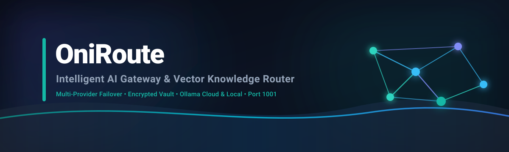
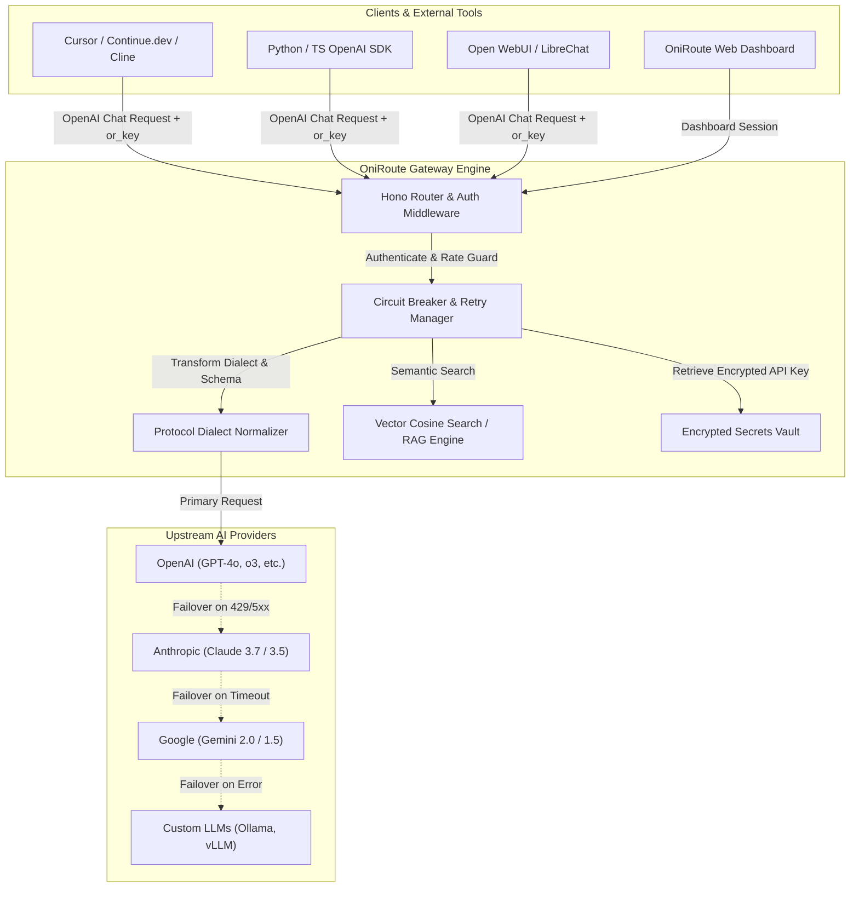

<p align="center">
  
</p>

<h1 align="center">OniRoute</h1>

<p align="center">
  <strong>Self-Hostable AI Gateway & Knowledge Router — Multi-Provider Failover, Encrypted Vault, Private Vector RAG, and OpenAI-Compatible API.</strong>
</p>

<p align="center">
  <a href="LICENSE"></a>
  <a href="CODE_OF_CONDUCT.md"></a>
  <a href="CONTRIBUTING.md"></a>
  <a href="SECURITY.md"></a>
  <a href="https://leadspree.in"></a>
</p>

<p align="center">
  
  
  
  
  
  
</p>

<p align="center">
  <a href="https://github.com/AniruddhaDas1/OniRoute/stargazers"></a>
  <a href="https://github.com/AniruddhaDas1/OniRoute/forks"></a>
  <a href="https://github.com/AniruddhaDas1/OniRoute/issues"></a>
  <a href="https://github.com/AniruddhaDas1/OniRoute/commits/main"></a>
</p>

---

## 📖 Table of Contents
- [Overview](#-overview)
- [Architecture & Request Flow](#-architecture--request-flow)
- [Quick Start](#-quick-start)
  - [Mode 1: Permanent Standalone Local Server (Port 1001)](#mode-1-permanent-standalone-local-server-port-1001--zero-docker-zero-cloud)
  - [Mode 2: Local Supabase Stack (Docker)](#mode-2-local-supabase-stack-docker--100-free)
  - [Mode 3: Supabase Cloud](#mode-3-supabase-cloud)
- [Universal Client Support (How Friends & Apps Connect)](#-universal-client-support-how-friends--apps-connect)
  - [1. IDEs & AI Coding Assistants (Cursor, Continue, Cline)](#1-ides--ai-coding-assistants-cursor-continuedev-cline)
  - [2. Python (OpenAI SDK)](#2-python-openai-sdk)
  - [3. TypeScript / Node.js](#3-typescript--nodejs)
  - [4. cURL](#4-curl)
- [Core Features](#-core-features)
  - [Smart Failover & Circuit Breaker](#1-smart-failover--circuit-breaker)
  - [Encrypted Key Vault](#2-encrypted-key-vault)
  - [Private Vector RAG Engine](#3-private-vector-rag-engine)
  - [Audit Logs & Token Accounting](#4-audit-logs--token-accounting)
- [Curated Coding Knowledge Base](#-curated-coding-knowledge-base)
- [Hosting on a Custom Domain](#-hosting-on-a-custom-domain)
- [API Reference](#-api-reference)
- [Verification & Testing](#-verification--testing)
- [License](#-license)

---

## 🌟 Overview

**OniRoute** is an open-source, self-hostable AI gateway designed to unify and safeguard your LLM infrastructure. Add multiple provider credentials once (OpenAI, Anthropic, Google Gemini, Custom OpenAI-compatible endpoints), and expose a single, high-reliability endpoint.

### Why OniRoute?
- **Unified Interface**: Use one OpenAI-compatible endpoint (`/v1/chat/completions`) across all models and providers.
- **Resilient Failover**: If an upstream provider returns `429 Too Many Requests`, `5xx Server Error`, or times out, OniRoute seamlessly retries with your backup providers without dropping client requests.
- **Zero Key Exposure**: Client apps, friends, and CI pipelines receive revocable `or_...` gateway keys. Upstream provider secrets remain securely encrypted in Supabase Vault or local AES-256-GCM storage.
- **Private Semantic RAG**: Ingest documentation from public GitHub repositories or text snippets. Automatically query 1536-dimensional embeddings to enrich completions with relevant context.
- **Flexible Deployment**: Run locally as a single Node process on **Port 1001** (zero external dependencies), in a local Docker Supabase stack, or deployed to Supabase Cloud.

---

## 🏗 Architecture & Request Flow



### What is Stored Where

| Data Category | Standalone Local Mode (Port 1001) | Supabase Cloud / Docker Mode |
| :--- | :--- | :--- |
| **Provider Configs & Logs** | `./data/oniroute_store.json` | PostgreSQL (`request_logs`, `ai_providers`) |
| **Provider API Keys** | AES-256-GCM (`./data/.secret_key`) | Supabase Vault (`vault.secrets`) |
| **Gateway Keys (`or_...`)** | SHA-256 Hashes | SHA-256 Hashes in PostgreSQL |
| **Vector Chunks & Embeddings**| High-Speed In-Memory Vectors | PostgreSQL (`pgvector` with HNSW Index) |

---

## 🚀 Quick Start

### Mode 1: Permanent Standalone Local Server (Port 1001 — Zero Docker, Zero Cloud)

Run OniRoute as a single, lightweight Node.js fullstack process:

```sh
# 1. Clone the repository
git clone https://github.com/AniruddhaDas1/OniRoute.git
cd OniRoute

# 2. Install dependencies
npm install

# 3. Start the local server
npm run local
```

* **Web Dashboard**: `http://localhost:1001`
* **OpenAI Chat Endpoint**: `http://localhost:1001/v1/chat/completions`
* **Health Check**: `http://localhost:1001/health`

> **Pro Tip**: To run the frontend in hot-reload development mode:
> ```sh
> VITE_API_URL=http://localhost:1001 npm run dev
> ```

---

### Mode 2: Local Supabase Stack (Docker — 100% Free)

Run the full Supabase Docker stack (PostgreSQL, `pgvector`, Supabase Vault, Auth, and Edge Functions):

```sh
# Start local Supabase containers and apply migrations
npm run setup:local

# Start the Vite dashboard
npm run dev
```

* **Web Dashboard**: `http://localhost:5173`
* **Supabase Studio**: `http://127.0.0.1:54323`
* **Gateway Endpoint**: `http://127.0.0.1:54321/functions/v1/api/v1/chat/completions`

---

### Mode 3: Supabase Cloud

1. Create a project at [supabase.com](https://supabase.com) and copy `.env.example` to `.env`.
2. Add your project URL and **publishable** key to `.env`.
3. Run the automated onboarding script:
   ```sh
   npm run setup
   npm run dev
   ```

---

## 👥 Universal Client Support (How Friends & Apps Connect)

Because OniRoute implements the standard **OpenAI Chat Completions API specification**, any external LLM tool, IDE, or script can connect directly to your OniRoute endpoint.

### 1. IDEs & AI Coding Assistants (Cursor, Continue.dev, Cline)

Configure your tool's OpenAI settings:
- **Base URL**: `http://YOUR_IP_OR_DOMAIN:1001/v1`
- **API Key**: `or_your_gateway_key` (created in the OniRoute dashboard)
- **Model**: `default` (or your configured model name)

---

### 2. Python (OpenAI SDK)

```python
from openai import OpenAI

# Connect to your OniRoute gateway
client = OpenAI(
    base_url="http://localhost:1001/v1",
    api_key="or_your_gateway_key"
)

response = client.chat.completions.create(
    model="default",
    messages=[
        {"role": "system", "content": "You are a helpful coding assistant."},
        {"role": "user", "content": "Explain binary search trees concisely."}
    ],
    temperature=0.7
)

print(response.choices[0].message.content)
```

---

### 3. TypeScript / Node.js

```typescript
import OpenAI from 'openai';

const client = new OpenAI({
  baseURL: 'http://localhost:1001/v1',
  apiKey: 'or_your_gateway_key',
});

async function main() {
  const response = await client.chat.completions.create({
    model: 'default',
    messages: [{ role: 'user', content: 'What are the benefits of OniRoute?' }],
  });

  console.log(response.choices[0].message.content);
}

main();
```

---

### 4. cURL

```sh
curl http://localhost:1001/v1/chat/completions \
  -H "Authorization: Bearer or_your_gateway_key" \
  -H "Content-Type: application/json" \
  -d '{
    "messages": [{"role": "user", "content": "Hello OniRoute!"}],
    "temperature": 0.7
  }'
```

---

## 🦙 Ollama Integration (Official Ollama Cloud & Ollama Local)

OniRoute has first-class native support for both **Official Ollama Cloud (`https://ollama.com/api`)** and **Ollama Local (`http://127.0.0.1:11434/api`)**:

### 1. Official Ollama Cloud Setup (`https://ollama.com/api`)
1. Create an API key at [ollama.com/settings/keys](https://ollama.com/settings/keys).
2. In the OniRoute Dashboard (**AI Providers** tab):
   - Click **Add Provider** and select the **Ollama Cloud / Remote** quick preset.
   - **Base URL**: `https://ollama.com/api`
   - **Chat Endpoint**: `/chat`
   - **Chat Model**: `llama3.3` (or `deepseek-r1`, `qwen2.5-coder`)
   - **Embedding Model**: `nomic-embed-text`
   - **API Key**: Your `OLLAMA_API_KEY` (sent via `Authorization: Bearer <key>`)
   - Click **Save Provider**.

### 2. Ollama Local Setup (100% Free & Offline)
1. Install and start [Ollama](https://ollama.com):
   ```sh
   ollama pull llama3.2
   ollama pull nomic-embed-text   # for local vector RAG
   ollama serve
   ```
2. In the OniRoute Dashboard:
   - Click **Add Provider** and select the **Ollama Local (11434)** quick preset.
   - **Base URL**: `http://127.0.0.1:11434/api`
   - **Chat Endpoint**: `/chat`
   - **Chat Model**: `llama3.2`
   - **Embedding Model**: `nomic-embed-text`
   - **API Key**: `ollama` (or any string)
   - Click **Save Provider**.

> **Failover with Ollama**: You can configure your local Ollama as your primary `$0/token` free provider, and automatically fail over to Official Ollama Cloud, OpenAI, or Anthropic in the cloud if your local GPU is overloaded or down!

---

## 💎 Core Features

### 1. Smart Failover & Circuit Breaker
- **Automatic Retries**: If your primary provider fails (`401`, `402`, `408`, `429`, `5xx`), OniRoute immediately routes the request to your next highest-priority provider.
- **Circuit Breaker**: Isolates repeatedly failing providers (threshold: 3 consecutive transient failures) for 5 minutes to prevent degrading downstream request latency.
- **Random / Priority Strategies**: Distribute requests evenly across active providers with uniform Fisher-Yates shuffling or enforce strict priority fallback order.

### 2. Encrypted Key Vault
- Upstream AI provider API keys are **never returned to the browser** and never logged.
- Standalone mode uses **AES-256-GCM** with a persistent local key file (`./data/.secret_key`).
- Supabase mode uses **Supabase Vault** (`vault.secrets`) with functions granted exclusively to the `service_role`.

### 3. Private Vector RAG Engine
- Ingest raw text or public GitHub repositories directly from the UI.
- Chunked via smart sliding-window segmentation (1,800 characters with 180-character overlap).
- **Sub-millisecond semantic retrieval**: In-memory cosine similarity search on local server; HNSW cosine index on Postgres.
- Request with `"mode": "refined"` to automatically retrieve and prepend private knowledge context to the prompt.

### 4. Audit Logs & Token Accounting
- Comprehensive request logs tracking exact latency, provider used, failover path, error reasons, and prompt/completion/total token counts.

---

## 📚 Curated Coding Knowledge Base

OniRoute includes an automated seeder script (`scripts/seed-knowledge.mjs`) containing **~33 curated documentation repositories** across the modern engineering stack:

| Category | Sources Included |
| :--- | :--- |
| **Web & Languages** | MDN (JS, CSS, HTTP, A11y), TypeScript Handbook, React Cheatsheets |
| **Frameworks** | React.dev, Next.js, Vue, Svelte, Angular, Astro, Nuxt, React Router |
| **UI Design Systems** | shadcn/ui, Radix UI, Tailwind CSS, Material UI, Bootstrap |
| **Backend & PHP** | Node.js API, Hono, Laravel 11.x, Symfony 7.2, PHP The Right Way |
| **Mobile & Desktop** | React Native, Flutter, Expo, Ionic, .NET MAUI, Electron, Tauri |

```sh
# Validate all remote repository paths without creating anything
node scripts/seed-knowledge.mjs --check

# Create and trigger asynchronous embedding ingestion
node scripts/seed-knowledge.mjs --ingest

# Ingest specific stacks only
node scripts/seed-knowledge.mjs --only react,flutter,laravel
```

---

## 🌐 Hosting on a Custom Domain

To allow friends and external clients to connect securely over the internet with a custom domain (e.g. `https://api.yourdomain.com/v1`):

### Option A: Cloudflare Tunnel (Free & No Open Ports)
```sh
# Expose your local port 1001 with free HTTPS
cloudflared tunnel route dns my-tunnel api.yourdomain.com
cloudflared tunnel run --url http://localhost:1001 my-tunnel
```

### Option B: VPS Reverse Proxy (Caddy)
```caddy
api.yourdomain.com {
    reverse_proxy localhost:1001
}
```

---

## 📡 API Reference

### OpenAI-Compatible Inference Endpoints

| Method | Route | Description | Auth Required |
| :--- | :--- | :--- | :---: |
| `POST` | `/v1/chat/completions` | Standard OpenAI chat completion endpoint | `or_...` Gateway Key |
| `POST` | `/chat` | Direct OniRoute chat completion endpoint | `or_...` Gateway Key |
| `GET` | `/v1/models` | List active configured providers as OpenAI models | Optional |
| `GET` | `/health` | Server health and port status | None |

### Management & Control Plane Endpoints

| Method | Route | Description |
| :--- | :--- | :--- |
| `GET` / `POST` | `/providers` | List or create AI providers |
| `PUT` / `DELETE` | `/providers/:id` | Update or delete a provider and its secret |
| `PUT` | `/providers/reorder` | Update provider priority failover order |
| `POST` | `/test-provider/:id` | Test connectivity & latency to an upstream provider |
| `GET` / `PUT` | `/routing-config` | Read or update routing strategy & failover rules |
| `GET` / `POST` | `/knowledge` | List or create knowledge sources |
| `POST` | `/knowledge/:id/ingest` | Trigger asynchronous vector embedding ingestion |
| `GET` / `POST` | `/gateway-keys` | List or generate SHA-256 hashed gateway keys |
| `DELETE` | `/gateway-keys/:id` | Revoke a gateway key |
| `GET` | `/logs` | Keyset-paginated audit trail of routed requests |

---

## 🧪 Verification & Testing

Run the automated test suite to verify cryptography, vector similarity, and API endpoints:

```sh
# Run local standalone server test suite
npm run test:local

# Run complete linting and TypeScript verification
npm run verify
```

---

## 📄 License

This project is licensed under the [MIT License](LICENSE).

---

## 👨‍💻 Author & Credits

**OniRoute** is designed, architected, and maintained by **[Aniruddha Das](https://github.com/AniruddhaDas1)**.

<p align="center">
  <strong>Powered by <a href="https://leadspree.in" target="_blank">Leadspree Business Solutions</a></strong>
</p>

